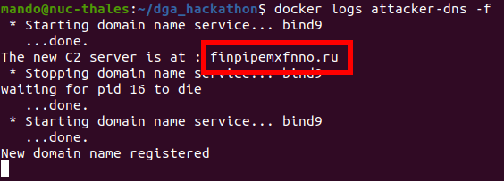
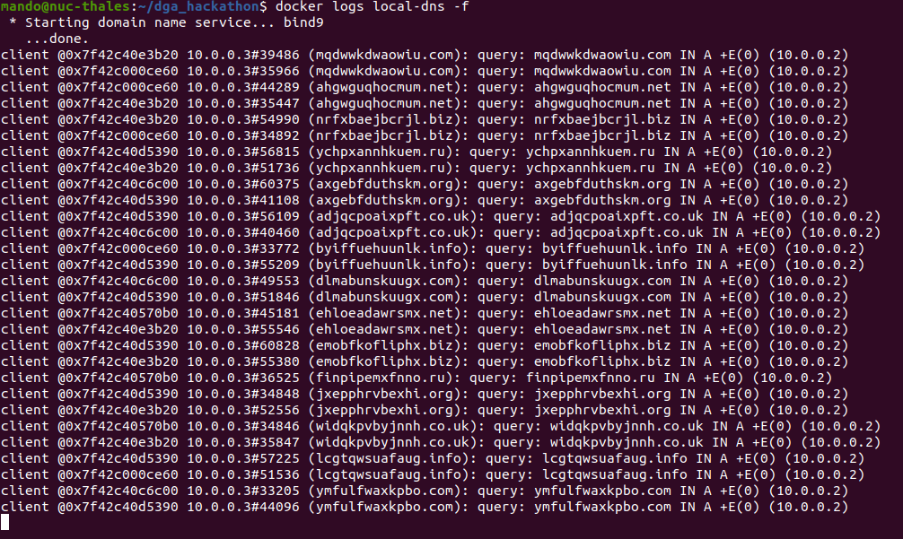
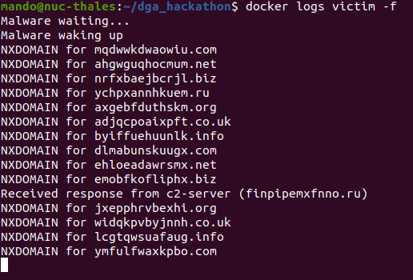
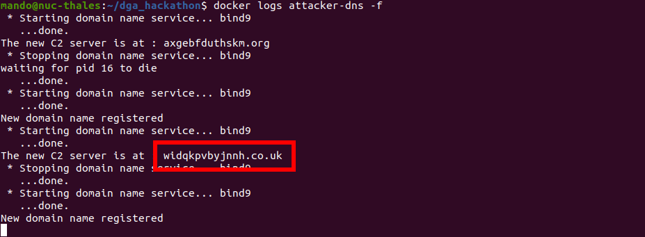
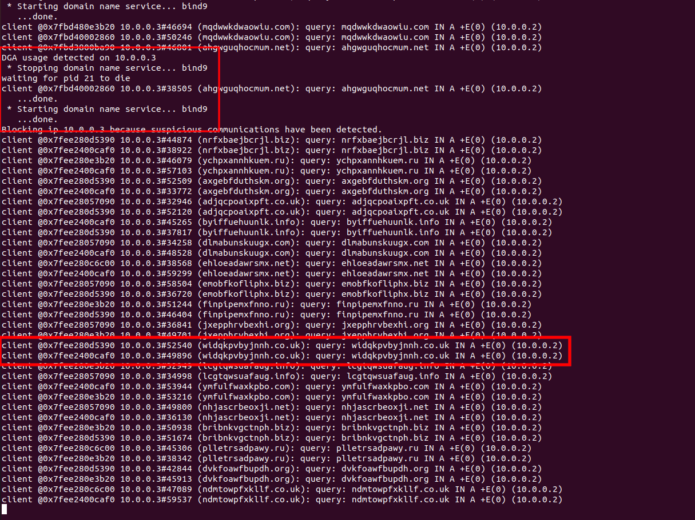
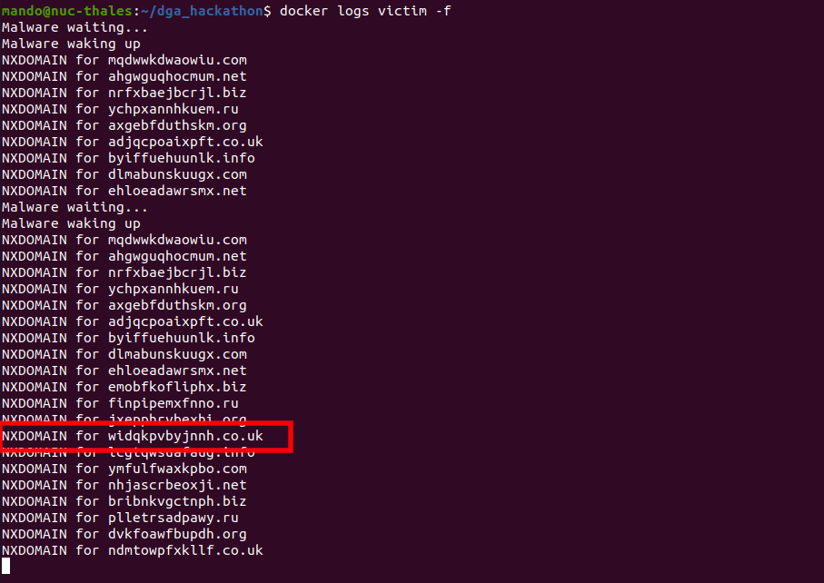

# DGAme-Over: fighting malware easily

## Usage

### Build images

```shell
(cd dns/local/ && docker build -t local-dns -f dns.dga.Dockerfile .)
(cd dns/attacker-dns/ && docker build -t attacker-dns -f dns.dga.Dockerfile .)
(cd machines/victim/ && docker build -t victim -f victim.dga.Dockerfile .)
(cd machines/c2-server/ && docker build -t c2-server .)
```

### Launch proof of concept

```shell
docker-compose up
```

### Access visualization

Go to the [skydive UI](http://localhost:8082/ui/topology).

### Generate domains

```shell
cd victim
python3 dgacollection/DGA.py
```

## Network Architecture

* Custom Network (dga_environment): 10.0.0.0/24
  * DNS victim (serving victim-domain.com): 10.0.0.2
  * victim machines (running the DGA): 10.0.0.3
  * DNS attackers : 10.0.0.0.251
  * C2-server (?????????.???): 10.0.0.0.250

## Explanations

The attacking DNS (10.0.0.251) registers randomly one of the 100 first domains generated for the C2-server (10.0.0.250). When the victim (10.0.0.3) queries the local DNS (10.0.0.3) (who only knows the location of the victim domain), the query is passed to other DNS (including the attacker's one).

That way the victim (in fact the malware) when spraying DNS request will receive NXDOMAIN for most urls except for the one registered by the attacker. In our PoC, we consider that the single fact that the response is not a NXDOMAIN is enough to assess that the malware has successfully connected to the c2-server.

## Techno

* DGA Collection [repo github](https://github.com/pchaigno/dga-collection)
* DNS [BIND9](https://wiki.debian.org/fr/Bind9)
* SkyDive for visualization [skydive](https://skydive.network/documentation/getting-started)

### Without DGAme-over

#### DNS owned by the attacker



#### Local victim's DNS



#### DGA output from the malware on the victim's machine




### With DGAme-over

#### DNS owned by the attacker



#### Local victim's DNS



#### DGA output from the malware on the victim's machine

